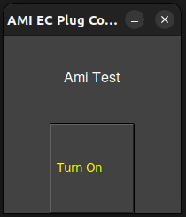
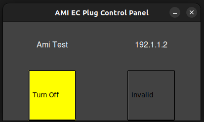
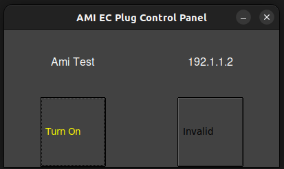

# Toggle Power - Tapo P100

Toggle power application is depending on [Tapo](https://github.com/mihai-dinculescu/tapo)[^1]

The application is designed to toggle power of the Tapo plug on GUI and CLI, which written in Python.


* [Toggle Power - Tapo P100](#toggle-power---tapo-p100)
   * [Installation](#installation)
   * [Usage](#usage)
   * [Guide](#guide)
      * [User Interactive](#user-interactive)
      * [GUI (Tkinter)](#gui-tkinter)
      * [Add plug](#add-plug)
      * [Username and Password](#username-and-password)
   * [Generate Executable File](#generate-executable-file)

## Installation

---

<br>

1. Download Tapo package - [Tapo](https://github.com/mihai-dinculescu/tapo)

   ```bash
   pip3 install tapo
   ```

<br>

## Usage

---

<br>

1. Execute `toggle_power.py`

   GUI:

   ```bash
   python3 toggle_power.py
   ```

   CLI:

   ```bash
   python3 toggle_power.py -i
   ```

<br>

## Guide

---

<br>

### User Interactive

1. Run the in terminal to open CLI UI.

    ```bash
    python3 toggle_power.py -i
    ```

1. The UI will pop up after connected all provided plugs.

    ```bash
    ==================================================
            AMI EC Plug Control Panel
    ==================================================
    Index  Device Name         Power Status
    --------------------------------------------------
      1    Ami Test            On
      2    192.1.1.2           N/A
    --------------------------------------------------
    Enter 0 ~ 2 to select device toggle power. Enter 'refresh'/'r' to refresh the device list. Enter 'exit' to exit.

    ```

1. Enter the index number to toggle power of the plug.

    ```bash
    Enter 0 ~ 2 to select device toggle power. Enter 'refresh'/'r' to refresh the device list. Enter 'exit' to exit.
    1
    ```

1. The power status will be updated after toggling power (ex. turn on -> turn off).

    ```bash
    ==================================================
            AMI EC Plug Control Panel
    ==================================================
    Index  Device Name         Power Status
    --------------------------------------------------
      1    Ami Test            Off
      2    192.1.1.2           N/A
    --------------------------------------------------
    Enter 0 ~ 2 to select device toggle power. Enter 'refresh'/'r' to refresh the device list. Enter 'exit' to exit.

    ```

<br>

### GUI (Tkinter)

1. open the GUI by running the script.

    ```bash
    python3 toggle_power.py
    ```

    

1. Press the <kbd> Turn On </kbd> or <kbd> Turn Off </kbd> button to toggle the power of the plug.

    
    

<br>

### Add plug

Plug(s) could be added by two ways: (1) CLI or (2) JSON file.

- Address could be found in the plug's device setting page:

    

    

<br>

1. CLI: provide the IP address in command line.

    ```bash
    python3 toggle_power.py --ip "<ip1> <ip2> <ip3>"
    ```

1. JSON File: include the IP address in the _~/.ami_ec_remote_plug.json_ file.

   _.ami_ec_remote_plug.json_:

   ```json
    {
      "ip": [
        "192.1.1.1",
        "192.1.1.2"
      ]
    }
    ```

   **ip**: the list of plugs IP address.

<br>

Example added 2 ip address, one is available and another is not available.

1. CLI: non-available IP address will be marked as "N/A".

    ```bash
    ==================================================
            AMI EC Plug Control Panel
    ==================================================
    Index  Device Name         Power Status
    --------------------------------------------------
      1    Ami Test            Off
      2    192.1.1.2           N/A
    --------------------------------------------------
    ```

1. GUI: non-available IP address will be marked as "Invalid" and indicate IP address.

    

<br>

### Username and Password

<br>

Username and password could be provided in three ways: (1) CLI or (2) JSON file or (3) prompt.

1. CLI: provide the _username_ and _password_ in command line.

    ```bash
    python3 toggle_power.py --username "<username>" --password "<password>"
    ```

1. JSON File: include the username and password in the _~/.ami_ec_remote_plug.json_ file.

   _.ami_ec_remote_plug.json_:

   ```json
    {
      "username": "<username>",
      "password": "<password>",
      "ip": [
        "192.1.1.1",
        "192.1.1.2"
      ]
    }
    ```

1. Prompt: the username and password will be prompted if not provided in CLI or JSON file.

   > not supported in GUI mode when disabled terminal prompt.

    ```bash
    python3 toggle_power.py
    ```

    username and password will be prompted in terminal.

    ```bash
    Enter Tapo account username: <username>@<domain>
    Enter Tapo account "<username>@<domain>" password: *****
    ```

<br>

## Generate Executable File

---

<br>

1. Install create executable file package - `pyinstaller`

    ```bash
    pip3 install pyinstaller
    ```

1. Create executable file

    ```bash
    pyinstaller -w --onefile toggle_power.py
    ```

1. Created executable file will generated in **dist/**, named as `toggle_power` or `toggle_power.exe`

    ```bash
    find dist/ -name "toggle_power*"
    ```

[^1]: Some other remote plug is not supporting, please reference other package [Kasa](https://github.com/python-kasa/python-kasa).
